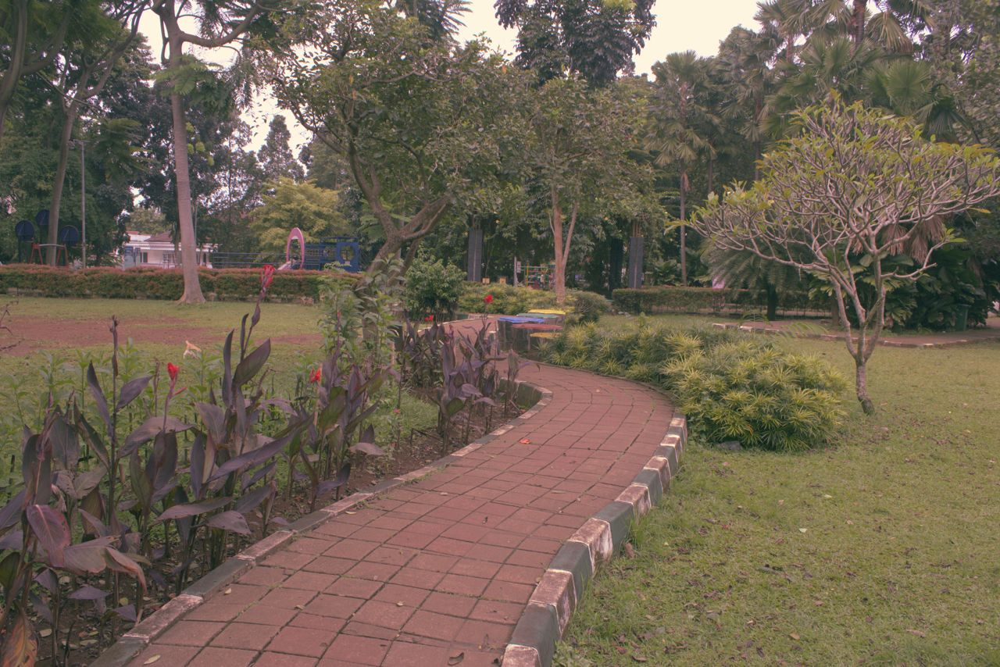
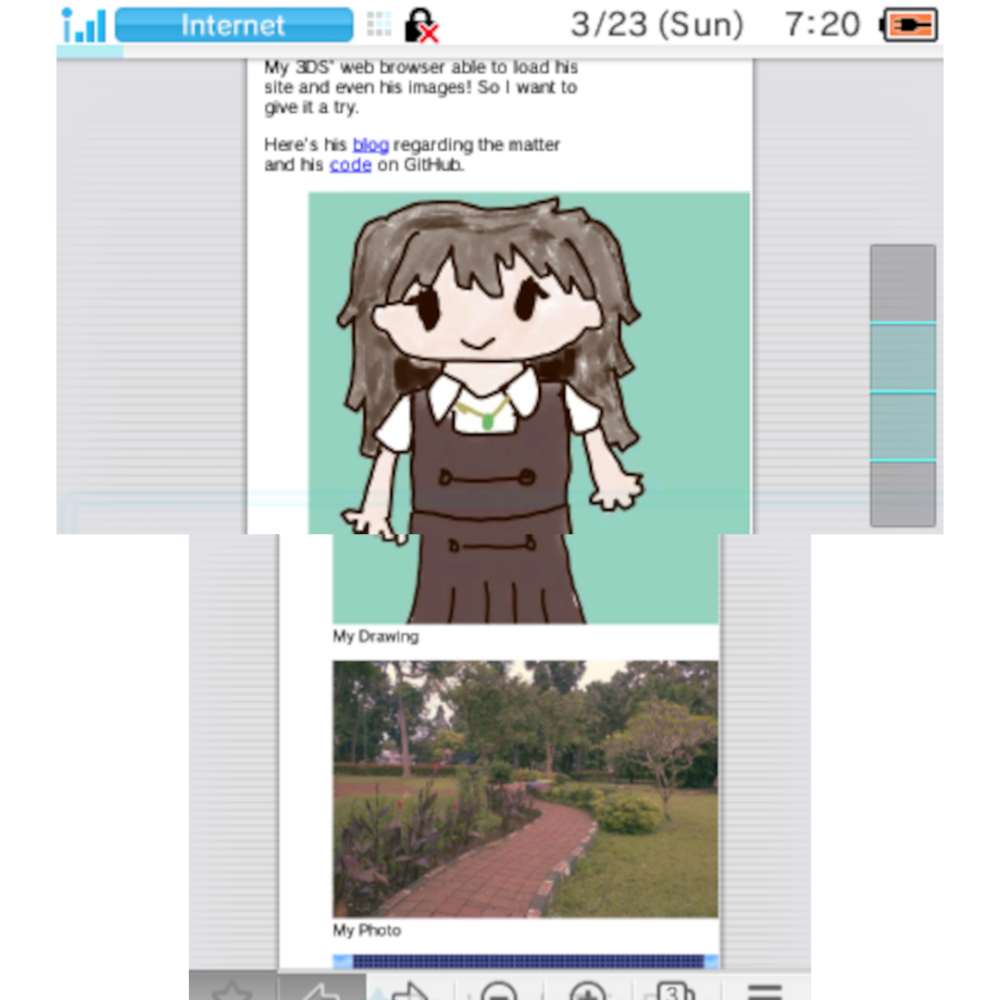

+++
date = '2025-03-23T06:46:14+07:00'
title = "Trying Eric Murphy's render_image"
tags = ['development', 'information']
nexprev = true
+++

Eric Murphy is a well known YouTuber in niche Linux/Privacy community that do web development.
His home base site, [ericmurphy.xyz](https://ericmurphy.xyz) have a really good code design and optimizations.

My 3DS' web browser able to load his site and even his images! So I want to give it a try.

Here's his [blog](https://ericmurphy.xyz/blog/images/)
regarding the matter and his [code](https://github.com/ericmurphyxyz/ericmurphy.xyz/blob/master/layouts/_default/_markup/render-image.html)
on GitHub.

